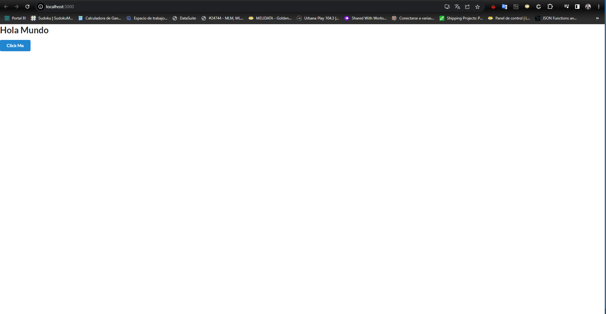

# Proyecto: Carta eléctronica para un restaurante

1. Dependencias: Node, Npm(Viene con node), Yarm(Se instala luego de NPM), Python3, Django, Django Rest Framework

---

## Paso a paso para comenzar el frontend de mi proyecto con React

1. Dependencias: Node, Npm y Yarn (se instala con Npm)
2. Con las dependencias instaladas y ubicando en la carpeta padre (la que contiene el frontend y el backend):

```bash
npx create-react-app icard_react_fullstack
```

Este comando ya me habrá armado un .gitignore y un README.md y me habrá inicializado un repositorio local con rama "master". Restaría cambiarle el nombre de la rama a "main" (estandar actual) y agregar el repo remoto mas la LICENSE

3. Para levantar nuestra aplicación hacemos:

```bash
yarn
yarn start
```

El primer comando instalará todas las dependencias necesarios en node_modules para poder llevar adelante un prouyecto react
El segundo comando encenderá el servidor de desarrollo para ir testeando nuestra react app en vivo y directo.

---

## Instalamos semantic UI react

Esta biblioteca nos ofrece los componentes que vamos a estar usando en nuestra app. Es una librería responsive. Es decir, nos sirve tanto para vista desde desktop (empleados del restaurante) como para vista mobile (clientes del restaurante)

1. Comandos a ejecutar para la instalación

```bash
$  yarn add semantic-ui-react semantic-ui-css
## Or NPM
$  npm install semantic-ui-react semantic-ui-css
```

2. Despues de instalarlo debemos importar CSS minificado en nuestra app´s entry file (index.js):

```js
import "semantic-ui-css/semantic.min.css";
```

Todas las dependencias de nuestro proyecto que instalemos van a quedar registradas en nuestro archivo package.json.
Por lo que si luego queremos instalar nuevamente las mismas en otra PC, o si estamos clonando un repositoria react de otro dev debemos hacer:

```bash
npm install
## Or Yarn
yarn install
```

El file index.js de nuestro package "src" nos debería quedar así (Comenté algunas lineas de código que ya no sirven luego de la librería de semantic):

```js
import React from "react";
import ReactDOM from "react-dom/client";
// import "./index.css"; Lo quitamos al importar semantic.min.css
import App from "./App";
import reportWebVitals from "./reportWebVitals";
import "semantic-ui-css/semantic.min.css";

const root = ReactDOM.createRoot(document.getElementById("root"));
root.render(
  //<React.StrictMode> Lo comentamos al importar semantic.min.css
  <App />
  //</React.StrictMode> Lo comentamos al importar semantic.min.css
);

// If you want to start measuring performance in your app, pass a function
// to log results (for example: reportWebVitals(console.log))
// or send to an analytics endpoint. Learn more: https://bit.ly/CRA-vitals
reportWebVitals();
```

3. Elimino de "src" el index.css, App.test.js, logo.svg, App.css también lo quitamos por el momento.

4. En App.js borramos todo y usamos el shorcut de la extension "ES7 React...": rfc
5. Con la estructura de "rfc" armada vamos crear el primer "Hola Mundo" en React que debería verse así:

```js
import React from "react";

export default function App() {
  return (
    <div>
      <h1>Hola Mundo</h1>
    </div>
  );
}
```

6. Ahora vamos a poner un primer botón de semantic UI en nuestra app así:

```js
import React from "react";
import { Button } from "semantic-ui-react";

export default function App() {
  return (
    <div>
      <h1>Hola Mundo</h1>
      <Button primary>Click Me</Button>
    </div>
  );
}
```

y con eso tendremos ademas del "Hola Mundo" un componente Button de semantic UI en nuestro front end que se vería algo así:



Esto significa que tenemos semantic UI añadido correctamente a nuestro proyecto listo para usarse en nuestra app para restaurantes.

---

## Configurando SASS para poder usar estilos

Está será la última configuración que vamos a hacer para poder sumar estilos a nuestro frontend y luego ya pasaremos a poner manos a la obra en la app.

SASS reemplazará a CSS en nuestro proyecto como proveedor de estilos dado que tiene una potencía mucho mas amplia.

Si creamos un archivo App.scss (tipo SASS) en nuestro proyecto así no mas el mismo no va a compilar. Dado que necesitamos una extensión más para que funcione:

1. Instalamos extensiones necesarios para SASS:

```bash
yarn add sass
```

Esto modificará automáticamente nuestro package.json dado que no es necesario en JS que lo hagomos nosotros como si lo es en python con pip.

2. Creamos estilos SASS (App.scss):

```scss
h1 {
  color: red;
}
```

3. Importamos los estilos en App.js:

```js
import React from "react";
import { Button } from "semantic-ui-react";
import "./App.scss";

export default function App() {
  return (
    <div>
      <h1>Hola Mundo</h1>
      <Button primary>Click Me</Button>
    </div>
  );
}
```

- ¿Que ventajas tiene usar SASS en lugar de CSS?

  1. Posibilidad de anidar estilos:

  ```css
  .app {
    background: green($color: #000000);

    &__title {
      color: red;
    }
  }
  ```

  El "&" en SASS lo que hace es continuar a la clase padre. Es decir que:

  "&" = .app

  ```js
  import React from "react";
  import { Button } from "semantic-ui-react";
  import "./App.scss";

  export default function App() {
    return (
      <div className="app">
        <h1 className="app__title">Hola Mundo</h1>
        <Button primary>Click Me</Button>
      </div>
    );
  }
  ```

Como todo esto lo hicimos para probar SASS entonces quitamos todo lo que agregamos por ahora tal como estaba antes de esta sección.

---

## Implementando nuestros sistema de rutas en react

Dependencias para nuestro sistema de rutas: React Router Dom v5

1. Agrego la dependencias:

```bash
yarn add react-router-dom
## Or Npm:
npm install react-router-dom
```

2. Creamos nuestros ficheros base para trabajar nuestro sistema de rutas. Para ello vamos a crear una carpeta que se llame "routes" dentro de nuestra carpeta "src".

3. Dentro del package routes vamos a crear un componente llamado Navigation.js que es el que vamos a importar en nuestro App.js

4. Le armo la estructura de un reactFunctionalComponent o "rfc" al archivo creado.

```js
import React from "react";
import { BrowserRouter as Router, Route, Switch } from "react-router-dom";

export default function Navigation() {
  return;
  <Router>
    <Switch>
      <h2>Navigation...</h2>
    </Switch>
  </Router>;
}
```

5. Armo un index.js y eliminó el "default" del export de function Navigation() de arriba para poder importarlo como paquete y seleccionar los elementos de mi paquete entre {}. El contenido de mi index.js es tan simple como:

```js
export * from "./Navigation";
```

5. Armo tres archivos para manejar mis rutas, dado que las por un lado voy a tener las rutas que va a poder navegar el admin del restaurante (routes.admin.js), por otro lado las rutas que van a navegar los clientes del restaurante (routes.client.js) y finalmente un archivo que a unir ambos conjunto de rutas (routes.js)

- routes.admin.js

```js
// Gestionamos las rutas de la interface del admin del restaurante
const routesAdmin = [];

export default routesAdmin;
```

- routes.client.js

```js
// Gestionamos las rutas de la interface del cliente del restaurante
const routesClient = [];

export default routesClient;
```

- routes.js (Por el momento no va a tener nada)

```js
// Archivo que va a gestionar las rutas
// routes.admin.js y routes.client.js se van a combinar acá
```

6. Ahora bien. Todo esto lo hemos realizado con react-router-dom v5 que ya tiene una versión mas nueva... La v6 así que veamos como hacer la misma configuración pero con la versión mas nueva...

---

## Instalando React Router V6

**Consejo importante: Siempre buscá la documentación oficial de la librería o framework que estás por instalar dado que allí está super especificado todo lo necesario para poner en funcionamiento la misma**

1. Instalar la librería usando yarn:

```bash
yarn add react-router-dom@6
```

2. Ahora configuramos nuestro router v6:

- Creamos el package routes dentro de src como antes.
- Creamos el Navigation.js dentro de routes también como antes.
- Creamos el index.js para poder exportar como paquete a routes y no por archivos individuales.
- index.js va a seguir teniendo el mismo contenido que tenía en la V5 ⬆️.
- Navigation.js sufre ligeras modificiones y queda así:

```js
import React from "react";
import { Routes, Route, Link } from "react-router-dom";

export function Navigation() {
  return;
  <Routes>
    <h2>Navigation V6...</h2>
  </Routes>;
}
```

- los tres archivos de gestión de rutas que creamos en la V5 quedan exactamente igual.

Listo! Ya tenemos nuestro administrador de rutas de React instalado y configurado.

---

## Layout para las screens

**Objetivo**: Que las secciones del admin se vean de una manera y las secciones del cliente se vean de otra distinta.

1. Armamos dentro de "src" un nuevo package llamado "layouts"
2. Dentro del paquete layouts vamos a agrupar en paquetes individuales los componentes react y los css´s que hacen al ClientLayout
3. Dentro del mismo vamos a crear nuestro ClientLayout.js que será nuestro componente React para los clientes del restaurante. Por el momento va a tener solamente una estructura basica de "rfc" de React:

```js
import React from "react";
import "./ClientLayout.scss";

export default function ClientLayout() {
  return (
    <div>
      <p>ClientLayout</p>
    </div>
  );
}
```

4. Creamos nuestro archivo de estilos para el lado del cliente. Que como hicimos al probar el botón lo vamos a estar trabajando con SCSS en lugar de CSS dado que tiene mucha mayor potencia. Por el momento quedará vacio este archivo. Solamente sumo el import del archivo de estilos a mi ClientLayout.js ⬆️

5. Preparamos la carpeta ClientLayout como paquete para poder importarla como tal. Lo cual, si recordás bien significa quitarle el "default" a la function ClientLayout() y armar un archivo dentro del paquete con nombre index.js donde especificamos el tipo de exportación de nuestro paquete (export \* from "./ClientLayout";)

6. Luego, dentro del paquete padre de ClientLayout que es layouts vamos a sumar un index.js que permite también exportar como paquete todo "ClientLayout" dado que es hijo de este paquete de orden superior y el mismo debe "autorizar" esta operación (export \* from "./ClientLayout";)

7. Luego vamos a comenzar a editar nuestra function de ClientLayout() para que reciba los props que serán usados en la function bajo la constante { children }. "props" primero y children despues contendrán el contenido a mostrar en nuestro layout. Por ejemplo, luego vamos a envolver nuestra App tal como está en la actualidad con este ClientLayout y el contenido de App se va a renderear en nuestro layout:

```js
import React from "react";
import "./ClientLayout.scss";

export function ClientLayout(props) {
  // props contendrá el contenido de nuestro layout. Esto viene del backend.
  const { children } = props;
  return (
    <div>
      <p>ClientLayout</p>
      {children}
    </div>
  );
}
```

8. Con esto ya tenemos un componente React de tipo ClientLayout() funcional que nos permitirá, al envolver nuestra app en este componente poder usar el mismo:

```js
import React from "react";
// import { Button } from "semantic-ui-react";
import { Navigation } from "./routes";

// importo mi ClientLayout para envolver mi app con el mismo
import { ClientLayout } from "./layouts";

export default function App() {
  return (
    <ClientLayout className="app">
      <h1 className="app__title">Hola Mundo</h1>
      <Navigation />
    </ClientLayout>
  );
}
```

9. Exactamente la misma estructura de layout le vamos a dar al lado del Admin del restaurante. Nos debería quedar un arbol así:

```bash
10:02:25 👽 with 🤖 mgobea 🐶 in icard_react_fullstack/src/layouts is 📦 0.1.0 via ⬢ v18.12.1 …
➜ tree
.
├── AdminLayout
│   ├── AdminLayout.js
│   ├── AdminLayout.scss
│   └── index.js
├── ClientLayout
│   ├── ClientLayout.js
│   ├── ClientLayout.scss
│   └── index.js
└── index.js
```

10. Este sistema de layouts ahora debemos implementarlo con nuestro sistema de rutas...Y para eso necesitamos paginas o pages por lo que armaremos dentro de src un nuevo packages con este nombre "pages" y esta estructura:

```bash
10:08:40 👽 with 🤖 mgobea 🐶 in icard_react_fullstack/src/pages is 📦 0.1.0 via ⬢ v18.12.1 …
➜ tree
.
├── Admin
│   ├── LoginAdmin.js
│   └── index.js
├── Client
│   ├── Home.js
│   └── index.js
├── Error404.js
└── index.js

2 directories, 6 files
```

Donde Home y LoginAdmin son dos pantallas. La primera es la Home del cliente y la segunda es la página de Login del administrador del restaurante. Los index.js como siempre nos sirven para poder exportar de forma sencilla los elementos del package

Ya tenemos los Layouts, ya tenemos las pages, podemos comenzar a crear nuestro sistema de rutas no sin antes crear una pagina para manejar el error 404 del lado del cliente de una forma mas amigable... La misma vivirá entre la raiz de pages, es decir, por fuera de client y admin dado que podemos mostrarsela a ambos usuarios.

Repasemos entonces la estructura de proyecto que debemos tener para poder comenzar a diseñar nuestro sistema de rutas. El mismo se diseña dentro de "src" y se debe ver así:

```bash
10:20:28 👽 with 🤖 mgobea 🐶 in icard_django_react/icard_react_fullstack/src is 📦 0.1.0 via ⬢ v18.12.1 …
➜ tree
.
├── App.js
├── index.js
├── layouts
│   ├── AdminLayout
│   │   ├── AdminLayout.js
│   │   ├── AdminLayout.scss
│   │   └── index.js
│   ├── ClientLayout
│   │   ├── ClientLayout.js
│   │   ├── ClientLayout.scss
│   │   └── index.js
│   └── index.js
├── pages
│   ├── Admin
│   │   ├── LoginAdmin.js
│   │   └── index.js
│   ├── Client
│   │   ├── Home.js
│   │   └── index.js
│   ├── Error404.js
│   └── index.js
├── reportWebVitals.js
├── routes
│   ├── Navigation.js
│   ├── index.js
│   ├── routes.admin.js
│   ├── routes.client.js
│   └── routes.js
└── setupTests.js

7 directories, 22 files
```

---

## Creando sistema de rutas con React Router v6.

Aclaración: aún se puede crear el sistema de rutas con React Router Dom v5, dado que no está deprecado. Pero es aconsejable trabajar con la versión 6. Por lo que vamos a crearlo directamente con la v6.

1. Definir las rutas de la partes administradora. Recordemos que las mismas deben ir en routes.admin.js:

```js
// Gestionamos las rutas de la interface del admin del restaurante

import { AdminLayout } from "../layouts";
import { LoginAdmin } from "../pages";

const routesAdmin = [
  {
    path: "/admin",
    layout: AdminLayout,
    component: LoginAdmin,
  },
];

export default routesAdmin;
```

2. Hacemos lo propio con la parte del cliente que se encuentra en routes.client.js:

```js
// Gestionamos las rutas de la interface del cliente del restaurante.

import { ClientLayout } from "../layouts";
import { Home } from "../pages";

const routesClient = [
  {
    path: "/",
    layout: ClientLayout,
    component: Home,
  },
];

export default routesClient;
```

3. Ahora combinamos ambas rutas (cliente y admin) en nuestro archivo admin.js:

```js
// Archivo que va a gestionar las rutas
// routes.admin.js y routes.client.js se van a combinar acá

import routerAdmin from "./routes.admin";
import routerClient from "./routes.client";

// const routes = [routerAdmin, routerClient] // Devuelve un cada import un array de objetos que se guarda dentro de un nuevo array. El resultado es algo así como: [[{}],[{}]].

const routes = [...routerAdmin, ...routerClient]; // Con los tres puntos adelante le estoy pidiendo solamente el contenido de mis arrays. Y no el array completo. Por lo que el resultado se verá como [{},{}] que es lo que buscabamos

export default routes;
```

4. Finalmente llevamos nuestras rutas a Navigation.js para rendearlas luego así:

```js
import React from "react";
import { BrowserRouter, Routes, Route } from "react-router-dom";
import routes from "./routes";

export function Navigation() {
  console.log("routes -->", routes); // Devuelve por consola un array con todas las configuraciones de rutas que hemos dado de alta. Este array debemos recorrerlo para renderearlo. Para eso vamos a usar el paquete "lodash".
  return (
    <BrowserRouter>
      <Routes>
        <Route index element={<h2>Navigation...</h2>} />
      </Routes>
    </BrowserRouter>
  );
}
```

5. Para renderear vamos a usar la extensión "lodash" la cual agregamos así:

```bash
yarn add lodash
```

6. Importamos "lodash" en Navigation.js y lo vamos a usar así:

```js
import React from "react";
import { BrowserRouter, Routes, Route } from "react-router-dom";
import { map } from "lodash";
import routes from "./routes";

export function Navigation() {
  console.log("routes -->", routes); // Devuelve por consola un array con todas las configuraciones de rutas que hemos dado de alta. Este array debemos recorrerlo para renderearlo. Para eso vamos a usar el paquete "lodash".
  return (
    <BrowserRouter>
      <Routes>
        {map(routes, (route, index) => (
          <Route
            key={index}
            path={route.path}
            element={
              <route.layout>
                <route.component />
              </route.layout>
            }
          />
        ))}
      </Routes>
    </BrowserRouter>
  );
}
```

Con esto ya tendremos nuestro React Router V6 completamente configurado y podremos abrir en el navegador cada uno de nuestros dominios y ver como se renderiza el layout y las pages del lado del cliente y del lado del administrador!!!

---

## Ruta Error404.
